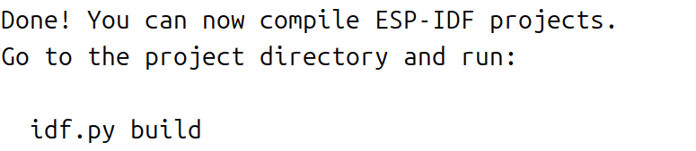
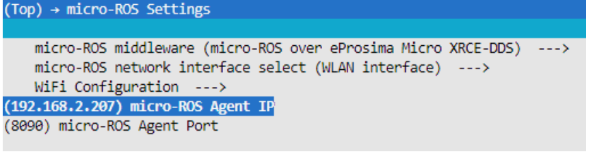
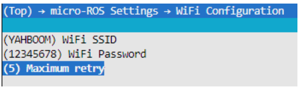
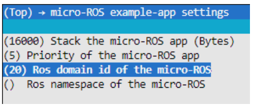

# 固件烧录

MicroROS 开发板固件烧录命令和操作注意事项。

## 依赖下载
### 1. 开发环境
1. 本机开发环境使用ubuntu22.04版本，ros版本使用humble版本。ros2下载参考[此链接](https://docs.ros.org/en/humble/Installation/Ubuntu-Install-Debs.html)
2. 树莓派的ros2环境下载[参考此文档](./INSTALL.md)

### 2. 安装依赖
1. 打开Ubuntu系统终端，并运行以下命令安装相关依赖。
```bash
sudo apt-get install \
  git wget unzip flex bison gperf \
  python3 python3-pip python3-venv \
  cmake ninja-build ccache \
  libffi-dev libssl-dev \
  dfu-util libusb-1.0-0
```

### 3. 下载ESP-IDF
打开Ubuntu系统终端，运行以下命令下载esp-idf-v5.1.2版本
```bash
mkdir -p ~/esp

cd ~/esp

git clone -b v5.1.2 --recursive https://github.com/espressif/esp-idf.git
```
设置工具支持的芯片esp32s3。
```bash
cd esp-idf

./install.sh esp32s3
```

### 4. 放置 extra_components 依赖

`extra_components` 是 `lidar_imu_publisher` 固件编译时使用的 micro-ROS 组件。收到 `extra_components.zip` 后，将它解压到 `alohamini_lidar_imu` 项目根目录：

```bash
cd /path/to/alohamini_lidar_imu
unzip /path/to/extra_components.zip
```

`/path/to/alohamini_lidar_imu` 和 `/path/to/extra_components.zip` 需要替换成接收方电脑上的实际路径。解压后必须保持以下目录结构：

```text
alohamini_lidar_imu/
├── extra_components/
│   └── micro_ros_espidf_component/
└── firmware/
    └── lidar_imu_publisher/
```

压缩包中可能包含原电脑生成的编译文件。接收方第一次编译前，建议执行以下命令清理其中的本机绝对路径，同时保留已经下载的 micro-ROS 源码：

```bash
cd /path/to/alohamini_lidar_imu

rm -rf extra_components/micro_ros_espidf_component/micro_ros_dev
rm -rf extra_components/micro_ros_espidf_component/micro_ros_src/build
rm -rf extra_components/micro_ros_espidf_component/micro_ros_src/install
rm -rf extra_components/micro_ros_espidf_component/micro_ros_src/log
rm -rf extra_components/micro_ros_espidf_component/include
rm -f extra_components/micro_ros_espidf_component/libmicroros.a
rm -f extra_components/micro_ros_espidf_component/esp32_toolchain.cmake
rm -rf firmware/lidar_imu_publisher/build
```

## 激活ESP-IDF开发环境
在esp-idf工具目录下运行以下命令
```bash
source ~/esp/esp-idf/export.sh
```
注意：每次打开新终端都需要先激活ESP-IDF开发环境才可以编译ESP-IDF的工程。看到如下信息则表示激活成功



## 编译和烧录固件

将microROS控制板连接到本机电脑的usb口，并进入本项目的/alohamini_lidar_imu/firmware/lidar_imu_publisher位置（若未激活开发环境，则运行命令激活环境。具体参考激活ESP-IDF开发环境）

### 1. 打开ESP-IDF的配置工具。

```bash
idf.py menuconfig
```

### 2. 打开micro-ROS Settings

在micro-ROS Agent IP填入代理主机的IP地址(这里填树莓派接入wifi后的真实IP地址)，在micro-ROS Agent Port填入代理主机的端口号（默认8090，可选其他端口）



### 3. wifi设置

依次打开micro-ROS Settings->WiFi Configuration，在WiFi SSID和WiFi Password这两栏填入WiFi名称和密码。



打开micro-ROS example-app settings，Ros domain id of the micro-ROS为5，如果局域网内有多用户同时使用的情况，可修改参数以避免冲突。Ros namespace of the micro-ROS默认为空，正常情况下可以不修改，如果修改非空字符（10个字符以内），则会在节点和话题前加上namespace参数。



## 编译烧录
```bash
cd /path/to/alohamini_lidar_imu/firmware/lidar_imu_publisher
idf.py build flash
```

### 3. 板子测试

进入路径，串口模拟板子运行

```bash
cd /path/to/alohamini_lidar_imu/firmware/lidar_imu_publisher
idf.py monitor -p /dev/ttyUSB0
```

完成后，Micro Ros板子所需要的代码就烧录完成了

