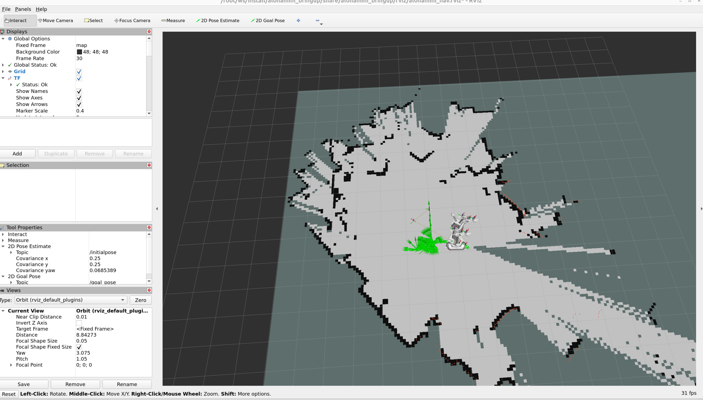
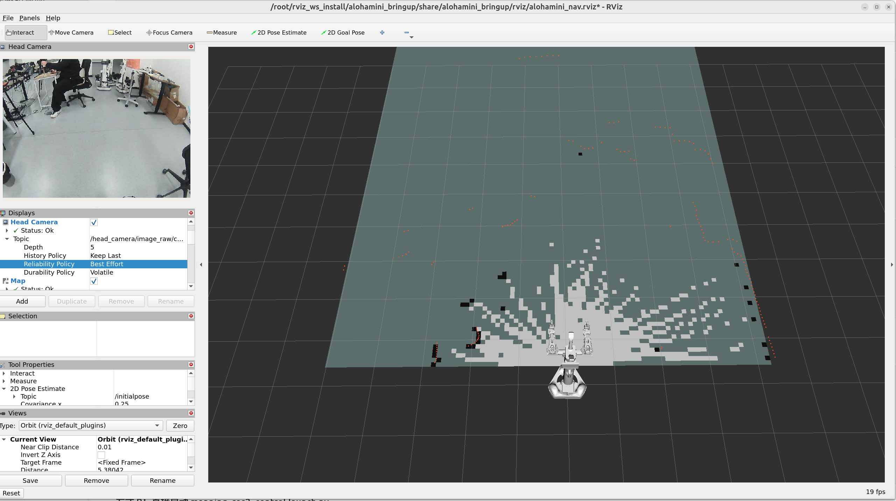

# AlohaMini 雷达 / IMU 建图、导航、RViz 完整使用流程

```bash
cd ~/alohamini_lidar_imu
```

## 1. 启动 micro-ROS Agent

micro-ROS Agent 负责把开发板发布的雷达和 IMU 数据接入 ROS2 网络。

```bash
cd ~/alohamini_lidar_imu
./ros2_ws/src/alohamini_bringup/scripts/start_microros_agent_after_time_sync
```

查看日志：

```bash
docker logs -f microros_agent
```

应能看到 micro-ROS session、topic、datawriter 创建日志。

## 2. 启动 / 进入 Nav2 容器

```bash
docker exec -it alohamini_nav2 /bin/bash
```

## 3. 构建 ROS2 工作空间

进入alohamini_nav2容器后，在树莓派执行：

```bash
source /opt/ros/humble/setup.bash
cd /root/ws
colcon build --symlink-install
source /root/ws/install/setup.bash
```

构建成功后应包含：

```text
alohamini_description
alohamini_base_control
alohamini_nav_bridge
alohamini_bringup
```

## 4. 建图

### 带键盘保存的建图会话

推荐现场使用这个方式。默认启动 `mapping_ros2_control.launch.py`，同时提供按键保存地图：

```bash
source /opt/ros/humble/setup.bash
source /root/ws/install/setup.bash
export ROS_DOMAIN_ID=5

ros2 run alohamini_bringup alohamini_mapping_session \
  --serial-port /dev/ttyACM0 \
  --map /root/ws/maps/alohamini_map \
  --enable-head-camera
```

如需关闭摄像头，不传 `--enable-head-camera`。

按键含义：

```text
w           前进
a / d       原地左转 / 原地右转
s           后退
z / x       左移 / 右移
r / f       加速 / 减速
Space 或 0  发送一次零速 /cmd_vel
Shift+S     保存当前地图，建图继续运行
Shift+X     保存当前地图，保存成功后停止建图 launch 并退出
q           不保存，停止建图 launch 并退出
Ctrl+C      不保存，停止建图 launch 并退出
```


```
rviz界面看到以下参考图片，则说明成功（rviz可视化参考第七章）



## 5. 保存地图。

建图会话终端按键：

```text
Shift+S  保存当前地图，建图继续运行
Shift+X  保存当前地图，保存成功后停止建图 launch 并退出
```

生成文件：

```text
/root/ws/maps/alohamini_map.yaml
/root/ws/maps/alohamini_map.pgm
```

地图文件在宿主机对应路径：

```text
~/alohamini_lidar_imu/ros2_ws/maps/
```

## 6. 导航

启动导航：

```bash
source /opt/ros/humble/setup.bash
source /root/ws/install/setup.bash
export ROS_DOMAIN_ID=5

ros2 launch alohamini_bringup navigation_ros2_control.launch.py \
  serial_port:=/dev/ttyACM0 \
  map:=/root/ws/maps/alohamini_map.yaml \
  enable_head_camera:=true
```

如需关闭摄像头，将命令中的参数改为 `enable_head_camera:=false`。

### 6.1 怎么确认起点和终点

```text
1. RViz Fixed Frame 设为 map。
2. 观察 RobotModel / LaserScan 是否和地图轮廓大致重合。
3. 如果不重合，用 2D Pose Estimate 在地图上点机器人实际位置，并拖出机器人朝向。
4. 等 particle cloud 收敛到机器人附近。
5. 再看 RobotModel、LaserScan 和地图是否对齐。
```

终点在 RViz 里给：

```text
1. 使用 Nav2 Goal / 2D Goal Pose 工具。
2. 在地图可通行区域点击终点。
3. 拖动箭头设置到达后的朝向。
4. 先给 0.5m 到 1m 的短距离目标。
5. 看到 global plan / local plan 出现后，再观察机器人是否开始低速移动。
```

## 7. RViz 可视化

建图和导航时都可以开 RViz。推荐方式是在本机/开发机运行 RViz，树莓派只运行 `micro-ROS Agent`、`alohamini_nav2` 容器和机器人进程。

### 7.1 本机已有 ROS2 Humble

如果本机是 Ubuntu 22.04，或者已经有可用的 ROS2 Humble 环境，直接使用本机 Humble。确认本机和树莓派在同一网络，并使用同一个 ROS Domain：

```bash
source /opt/ros/humble/setup.bash
export ROS_DOMAIN_ID=5
export ROS_LOCALHOST_ONLY=0
```

首次使用或代码更新后，在本机构建这个 ROS2 工作空间：

```bash
cd ~/project/alohamini_lidar_imu/ros2_ws
source /opt/ros/humble/setup.bash
colcon build --symlink-install
source install/setup.bash
```

启动本项目的 RViz 配置：

```bash
export ROS_DOMAIN_ID=5
export ROS_LOCALHOST_ONLY=0
ros2 launch alohamini_bringup rviz.launch.py
```

### 7.2 本机是 Ubuntu 24.04

Ubuntu 24.04 不适合作为原生 ROS2 Humble 环境。此时在本机用 Docker 创建一个 Humble RViz 容器，容器通过 host 网络加入树莓派同一个 ROS2 网络。

本机先允许 Docker 容器访问 X11 显示：

```bash
xhost +local:docker
```

创建并进入本机 RViz 容器：


下面是首次创建命令。`docker rm -f` 会删除旧容器；如果已经安装过依赖，不要重复执行这一行，直接用后面的 `docker start -ai alohamini_rviz_humble` 复用容器。

```bash
cd ~/project/alohamini_lidar_imu

docker rm -f alohamini_rviz_humble 2>/dev/null || true

docker run -it \
  --name alohamini_rviz_humble \
  --net=host \
  --ipc=host \
  -e DISPLAY=$DISPLAY \
  -e QT_X11_NO_MITSHM=1 \
  -e ROS_DOMAIN_ID=5 \
  -e ROS_LOCALHOST_ONLY=0 \
  -e RMW_IMPLEMENTATION=rmw_fastrtps_cpp \
  -v /tmp/.X11-unix:/tmp/.X11-unix:rw \
  -v "$PWD/ros2_ws:/root/ws" \
  osrf/ros:humble-desktop \
  bash
```

容器内安装本项目 RViz 需要的依赖并构建工作空间：

```bash
apt update
apt install -y --no-install-recommends \
  ros-humble-nav2-rviz-plugins \
  ros-humble-image-transport-plugins \
  python3-colcon-common-extensions

cd /root/ws
source /opt/ros/humble/setup.bash
colcon --log-base /root/rviz_ws_log build --symlink-install \
  --build-base /root/rviz_ws_build \
  --install-base /root/rviz_ws_install
source /root/rviz_ws_install/setup.bash
```

容器内启动 RViz：

```bash
export ROS_DOMAIN_ID=5
export ROS_LOCALHOST_ONLY=0
export RMW_IMPLEMENTATION=rmw_fastrtps_cpp
ros2 launch alohamini_bringup rviz.launch.py
```

机器人视角：
* 找到左侧Head Camera
* 点开选择Topic -> Reliability Policy -> 选择Best Effort 即可在上方显示图像位置看到相机图像


以后再次使用这个本机 RViz 容器：

```bash
docker start -ai alohamini_rviz_humble
cd /root/ws
source /opt/ros/humble/setup.bash
source /root/rviz_ws_install/setup.bash
export ROS_DOMAIN_ID=5
export ROS_LOCALHOST_ONLY=0
ros2 launch alohamini_bringup rviz.launch.py
```

